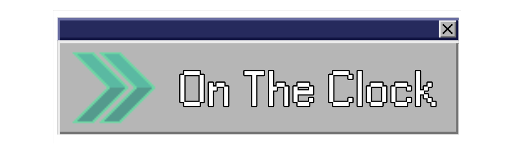
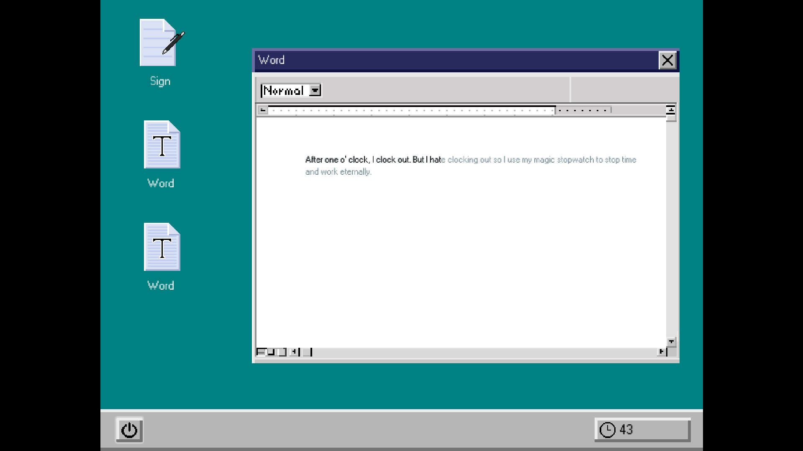
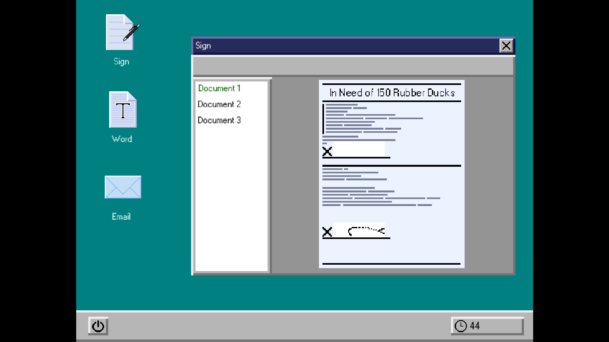

# On The Clock

Work on the clock at your corporate office job. Time is of the essence as you rush to complete tasks on your computer to earn a promotion. You will need to write text, sign documents, and respond to emails under a time constraint. Suboptimal performance is not to be expected. The clock is ticking, and you are replaceable.

**Controls:** Mouse and Keyboard

This game was created for the 2026 GMTK Game Jam (and Hack Club's jame gam) with a team of 5 people. We used [Godot](https://godotengine.org/) for the engine, [Aseprite](https://www.aseprite.org/) for art, and [LMMS](https://lmms.io/) for music.

The entire game is modeled after a Windows-95-ish aesthetic and the minigames are similar to common office tools and tasks.

There are a total of 3 minigames with many different variations and plenty of text to read about your coworkers, (especially Garrett). There are also a total of 14 ranks that you can be promoted to, each increasing in the number of minigames you have to complete, all while giving less time. You must complete your tasks on time or you'll be **fired**!

## Credits

**Frookus** - Programmer

**Deelan** - Programmer

**Kadia** - Artist, Composer, Writer

**Nman29** - Artist, Writer

**bobguyhuman** - Artist, Writer

Font: W95FA
